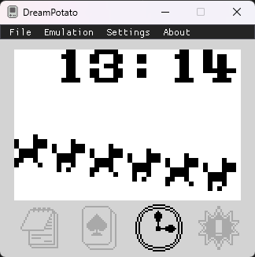
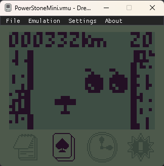
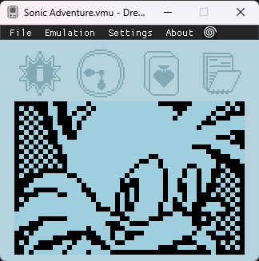

# DreamPotato

DreamPotato is a Dreamcast VMU emulator in currently in beta.

> [!WARNING]
> When opening a `.vmu` or `.bin` file, the emulator will modify the file on disk while running in order to persist changes, such as save file changes on the memory card, saving your progress in minigames, or when using the Load State command.
> Consider making copies of VMU files before using them to avoid any chance of corrupting your saves.
> `.vms` files opened in the emulator will not be modified.

[Download Latest Release](https://github.com/RikkiGibson/DreamPotato/releases/latest)

See [compatibility.md](compatibility.md) for the current compatibility status of various games.

    
    
    

## Flycast Integration

[Demo Video](https://www.youtube.com/watch?v=EN8Y3UX_TDM)

DreamPotato can connect to [Flycast](https://github.com/flyinghead/flycast) to support an experience similar to using a real Dreamcast and VMU together. This feature is now available in the **Flycast dev branch**. See [Flycast Builds](https://flyinghead.github.io/flycast-builds/) for the latest dev branch builds.

Instructions:
1) Open the Flycast controller settings. Enable "**Use Physical VMU Memory**". Enable "**Use Network Expansion Devices**" for the controller port you want to use to connect.
2) Once both Flycast and DreamPotato are running, start a game in Flycast. After a moment, the swirl icon should appear in the DreamPotato menu bar indicating things are connected.
3) If you get disconnected, pause Flycast and hit the Connect button to reconnect.

Additional notes/caveats:
1) DreamPotato defaults to connecting to slot A1. You can go into the settings and change this if you wish.
2) If you disable **Use Physical VMU Memory**, then Flycast will use its own internal VMU files for saving/loading games. DreamPotato will still display VMU graphics in that case.
    - When loading state in Flycast, Use Physical VMU Memory will be temporarily disabled. You'll need to pause the game and disconnect/reconnect DreamLink in order to resume using DreamPotato's VMU memory.
2) DreamPotato will "take over" all the expansion devices for a given controller. So, if you want to do stuff like copy between Flycast-managed and DreamPotato-managed VMUs, you'll have to put them in separate controllers.
3) DreamPotato does not play sound while docked to a controller. You should leave the Flycast VMU sound setting enabled if you want that. (DreamPotato *does* play sound in standalone mode.)
4) If you want to use DreamPotato with multiple ports, you can launch multiple instance, and set a different Dreamcast Slot setting for each one.
5) In Chao Adventure, you need to hit Mode to exit the game before inserting the VMU, or your progress may not be saved.

## Usage

Download the latest bits from the [Releases](https://github.com/RikkiGibson/DreamPotato/releases) section.

### Default Key Mappings
- W - Up
- A - Left
- S - Down
- D - Right
- K - A
- L - B
- I - Mode
- J - Sleep
- Insert - Dock/Eject VMU to Dreamcast controller
    - You can also hold the Sleep button for 1 second to toggle docking/ejecting the VMU.
- F5 - Save State
- F8 - Load State
- F10 - Pause/Resume
- Tab (hold) - Fast Forward

### Configuration

General configuration options include:
- `AutoInitializeDate`: bool, default true. If true, skips the startup beep and date setup, and uses your computer's clock to initialize the VMU's clock. Specify false if you want to use the date setup sequence as you would when installing batteries with real hardware.
- `AnyButtonWakesFromSleep`: bool, default true. If true, any button will wake the VMU from sleep. If false, only the sleep button will do that.

Key and button mappings can be changed in Settings -> Keyboard Config / Gamepad Config.

## Building

- You'll need a [.NET 9 SDK](https://dotnet.microsoft.com/en-us/download/dotnet/9.0) matching the version in [global.json](./global.json) installed on your computer.
- Copy your `american_v1.05.bin` VMU ROM into `src/DreamPotato.MonoGame/Data/`.
- Build everything: `dotnet build`.
- Run the emulator: `dotnet run --project src/DreamPotato.MonoGame`.
- Run tests: `dotnet test`

## Project Overview

Under `src/`:
- `DreamPotato.Core` is where the emulator implementation resides.
- `DreamPotato.Tests` includes unit tests for the emulator implementation.
- `DreamPotato.MonoGame` is the front-end, including UI and config file handling.
- `dreampotato-vscode` is the VS Code extension--in *very* barebones/"alpha" state.
    - Currently, it contains only a TextMate grammar for LC86k assembly.

## Why write a new emulator?

The biggest reason was: I was interested in timing-based luck manipulation in Pinta's Quest, which requires emulating the game at a very similar speed to real VMU hardware. I found that existing emulators did not run the game at a similar enough speed to real hardware to allow the same timings to work. I thought that writing a new emulator from scratch would be a good way to learn the hardware well enough to get to the bottom of how to do that.

## Acknowledgements

Thanks to the following individuals, whose invaluable work on VMU emulation and reverse engineering helped make DreamPotato possible.

- Falco Girgis, author of [ElysianVMU](http://evmu.elysianshadows.com/)/[libevmu](https://github.com/gyrovorbis/libevmu) and extensive [documentation](https://vmu.elysianshadows.com/index.html) of VMU internals.
- Dmitry Grinberg for his [VMU hackery](https://dmitry.gr/index.php?r=05.Projects&proj=25.%20VMU%20Hacking) project.
- Walter Tetzner, author of the [waterbear](https://github.com/wtetzner/waterbear) assembler/disassembler.
- Homebrew developers jvsTSX and Jahan Addison for publishing [homebrew](https://github.com/jvsTSX/VMU-MISC-CODE) [software](https://github.com/jahan-addison/snake) which was very helpful for testing the emulator.
